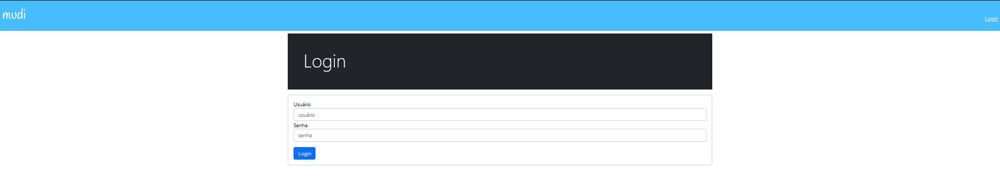
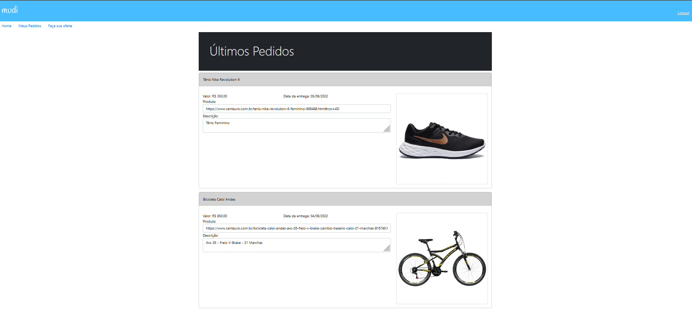
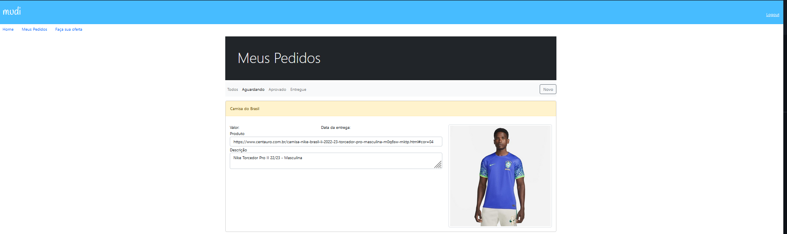
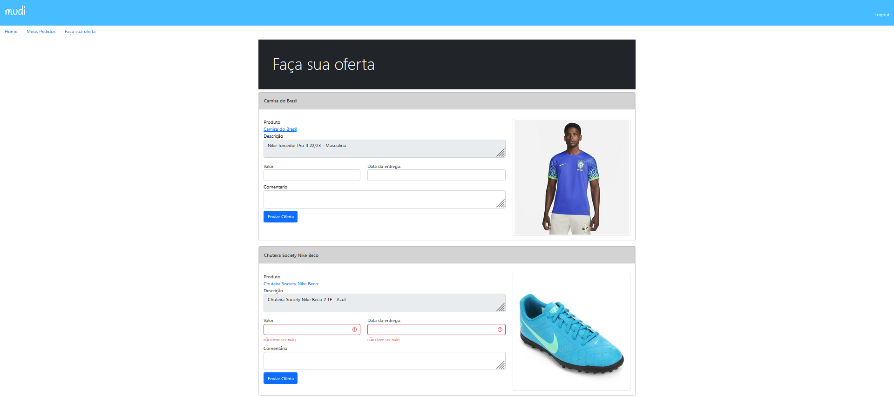

<h1 align="center">Mudi Web</h1>

<h2>🎯 Objetivo do Projeto</h2>

 Construção de uma aplicação Web que conecta comprador, no qual pode cadastrar um produto que deseja comprar, e o viajante, que pode fazer uma proposta para trazer o produto desejado.

<h2>🛠 Funcionalidades</h2>
<ul>
    <li>Realizar Login</li>
    <li>Realizar Logout</li>
    <li>Visualizar Pedidos</li>
    <li>Cadastrar Pedidos</li>
    <li>Enviar ofertas</li>
</ul>

<h2>🛠 Tecnologias Utilizadas </h2>
<ul>
    <li>Java 17</li>
    <li>Spring Boot</li>
    <li>Spring Data JPA</li>
    <li>Spring Security</li>
    <li>Spring Validation</li>
    <li>MariaDB</li>
    <li>Lombok</li>
    <li>Thymeleaf Security 5</li>
    <li>Thymeleaf</li>
    <li>VueJS</li>
</ul>

<h2>💻 Imagens do Sistema </h2>

<h3> Tela de Login </h3>

  

<h3> Tela Principal </h3>

  

<h3> Tela dos Pedidos </h3>

  

<h3> Tela de Ofertas </h3>

  

